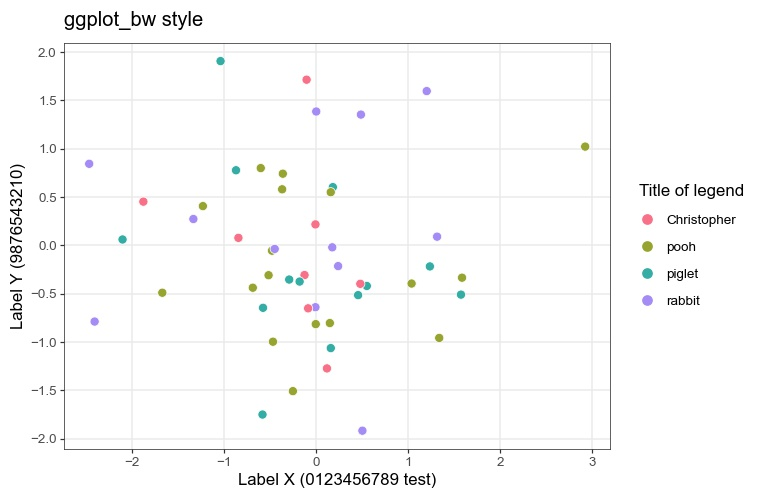

# Overview
Matplotlib style sheet based on ggplot

# Installation
Just copy the style file, i.e. ggplot_bw.mplstyle or ggplot_classic.mplstyle, where your Python source codes are.

# Usage
```python
import matplotlib.pyplot as plt
plt.style.use('ggplot_bw.mplstyle') # or ggplot_classic.mplstyle
```

# Example
```python
import matplotlib.pyplot as plt
plt.style.use('ggplot_bw.mplstyle')

```


